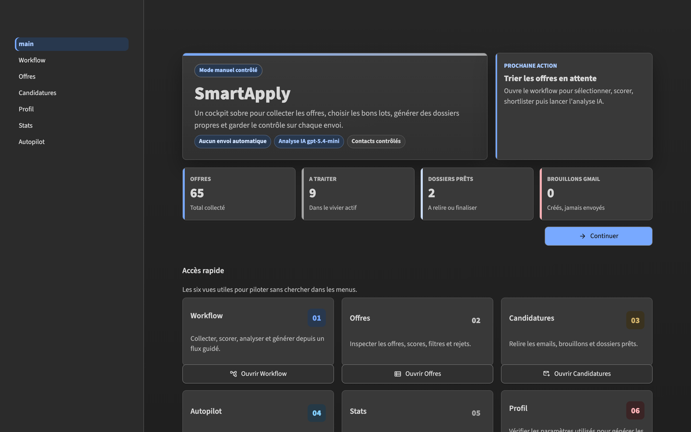
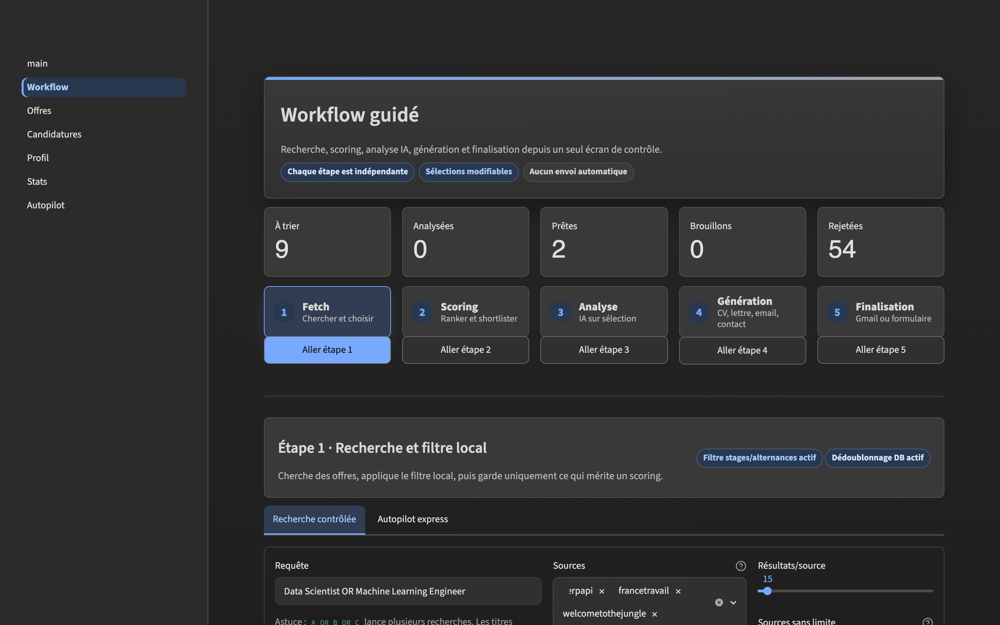

# SmartApply

SmartApply est un assistant de candidature pour le marché français. Il recherche des offres, filtre les doublons, classe les opportunités par pertinence, génère un dossier adapté (CV, lettre, email) et prépare un brouillon Gmail ou un export `.eml`.

Le principe est simple : automatiser la préparation, jamais l'envoi. Chaque candidature reste sous contrôle humain.



## Fonctionnalités

- Recherche multi-sources : France Travail, Welcome to the Jungle, Google Jobs via SerpApi et saisie manuelle.
- Filtrage local : dédoublonnage, signaux de contrat, localisation, rôle et niveau d'expérience.
- Scoring sémantique : classement des offres selon le profil candidat.
- Génération assistée par IA : CV, lettre de motivation et email adaptés à l'offre.
- Validation anti-hallucination : les éléments générés doivent rester rattachés au profil source.
- Finalisation contrôlée : brouillon Gmail ou export `.eml`, sans envoi automatique.
- Dashboard Streamlit : workflow guidé, offres, candidatures, profil et statistiques.

## Démarrage rapide

```bash
make install-all
cp .env.example .env
make init-db
make test
make run-app
```

Installation minimale, sans UI, PDF et Gmail :

```bash
make install
```

L'application Streamlit se lance avec :

```bash
make run-app
```

## Configuration

Renseigner les variables utiles dans `.env` après copie de `.env.example`.

| Variable | Usage | Obligatoire |
|---|---|---|
| `OPENAI_API_KEY` | LLM et embeddings | Oui, sauf provider `mock` |
| `FRANCETRAVAIL_CLIENT_ID` / `FRANCETRAVAIL_CLIENT_SECRET` | API France Travail | Si la source est active |
| `SERPAPI_API_KEY` | Google Jobs via SerpApi | Si la source est active |
| `WTTJ_COOKIE` | Welcome to the Jungle | Si la source est active |
| `GMAIL_CREDENTIALS_PATH` | Création de brouillons Gmail | Optionnel |
| `ANYMAILFINDER_API_KEY` | Enrichissement de contacts | Optionnel |
| `PROFILE_DIR` | Dossier du profil local privé, par défaut `./smartapply/profile/data` | Optionnel |
| `TOP_K_RANKED` | Nombre d'offres retenues pour analyse | Optionnel |
| `EMBEDDINGS_PROVIDER` | `openai`, `local` ou `mock` | Optionnel |

Le dossier `smartapply/profile/data/` est volontairement local et ignoré par Git,
car il contient des données personnelles. Le dossier versionné
`smartapply/profile/mock_profile/` donne uniquement la forme attendue des JSON.

## Workflow



| Étape | Objectif | Sortie |
|---|---|---|
| 1. Recherche | Collecter les offres depuis les sources configurées | Offres brutes |
| 2. Filtrage | Nettoyer, dédoublonner et exclure les offres non pertinentes | Offres candidates |
| 3. Scoring | Classer les offres selon le profil | Shortlist priorisée |
| 4. Analyse | Extraire les critères, risques et contacts utiles | Fiche offre structurée |
| 5. Génération | Produire CV, lettre et email personnalisés | Dossier de candidature |
| 6. Finalisation | Prévisualiser puis créer un brouillon Gmail ou un `.eml` | Candidature prête |

Deux modes sont disponibles :

- **Recherche contrôlée** : validation manuelle à chaque étape.
- **Autopilot express** : génération en bloc avec quality gate, sans envoi automatique.

## Interface

| Page | Description |
|---|---|
| [Workflow](docs/screenshots/workflow.png) | Pipeline guidé, manuel ou autopilot |
| [Offres](docs/screenshots/offres.png) | Recherche, détail et récupération d'offres archivées |
| [Candidatures](docs/screenshots/candidatures.png) | Dossiers générés et brouillons |
| [Profil](docs/screenshots/profil.png) | Profil candidat et sources utilisées par le validateur |
| [Stats](docs/screenshots/stats.png) | Entonnoir, coût LLM et suivi de pertinence |
| [Autopilot](docs/screenshots/autopilot.png) | Runs haut volume contrôlés |

## CLI

```bash
smartapply init-db
smartapply ingest --source francetravail --query "Data Scientist" -l "Paris" --date-posted week
smartapply ingest-url --url https://example.com/jobs/42
smartapply ingest-text --title "ML Engineer" --company "Acme" --file offer.txt
smartapply process --top-k 20
smartapply apply --job-id 42 --gmail-draft
smartapply pipeline --source francetravail --query "Data Scientist" -l "Paris" --top-apply 5
smartapply autopilot --query "Data Scientist OR ML Engineer" -l "Paris" --target-drafts 25 --gmail-draft
smartapply stats
```

## Architecture

```text
Sources d'offres
  -> parsing et dédoublonnage
  -> filtrage local
  -> scoring sémantique
  -> analyse LLM structurée
  -> génération CV / lettre / email
  -> validation anti-hallucination
  -> brouillon Gmail ou export .eml
  -> suivi SQLite + dashboard Streamlit
```

Principaux modules :

- `smartapply/scrapers` : connecteurs d'offres.
- `smartapply/offers` : contrats d'offres et adapters par source.
- `smartapply/filtering` : signaux locaux et exclusions.
- `smartapply/ranking` : embeddings et scoring.
- `smartapply/llm` : analyse et génération structurées.
- `smartapply/cv` : adaptation, validation et rendu du CV.
- `smartapply/contacts` : recherche, validation et cache des contacts.
- `smartapply/email_agent` : brouillons Gmail, exports `.eml` et template email.
- `smartapply/pipeline` : orchestration du workflow.
- `smartapply/app` : interface Streamlit.

## Qualité et sécurité

- Les tests locaux sont ignorés par Git et conçus pour tourner offline avec les API externes mockées.
- La génération est encadrée par des schémas JSON stricts.
- Les bullets de CV et la lettre sont contrôlés par des validateurs déterministes.
- Gmail ne crée que des brouillons via `users().drafts().create`.
- Les appels d'envoi Gmail sont bloqués par test statique.
- Les secrets (`.env`, tokens, credentials) sont exclus du versionnement.
- Le profil personnel (`smartapply/profile/data/`) est exclu du versionnement.
- Le scraper manuel refuse les URLs locales, privées ou non HTTP(S).

Commandes utiles :

```bash
make test
make test-fast
make lint
make format
```

## Documentation

- Architecture détaillée : [docs/architecture.md](docs/architecture.md)
- Détails des sources : [docs/sources](docs/sources/)
- Captures d'écran : [docs/screenshots](docs/screenshots/)
- Configuration complète : [.env.example](.env.example)

## Licence

MIT
