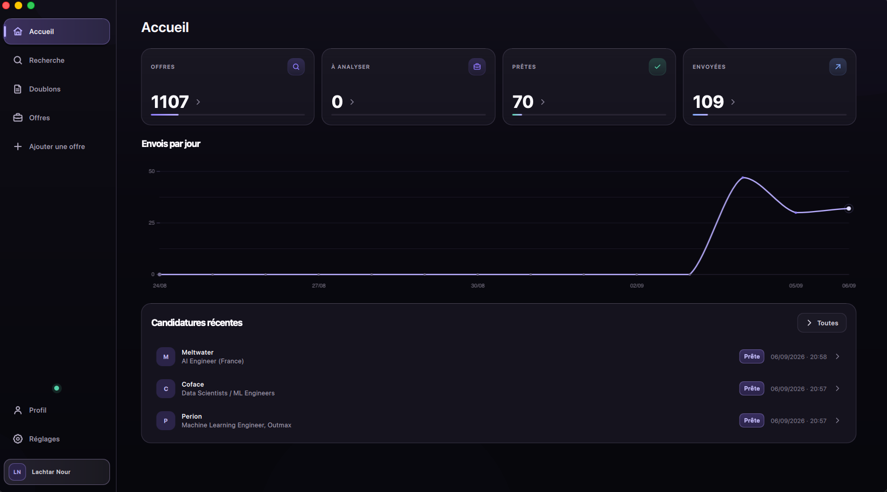
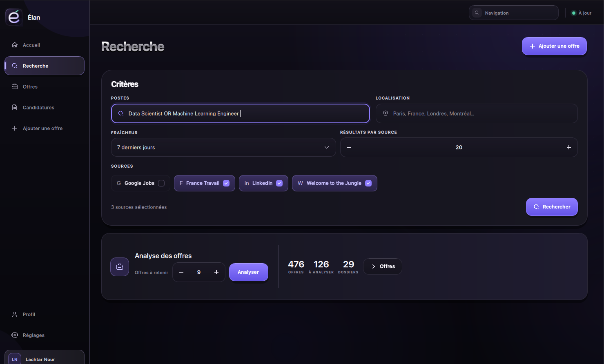
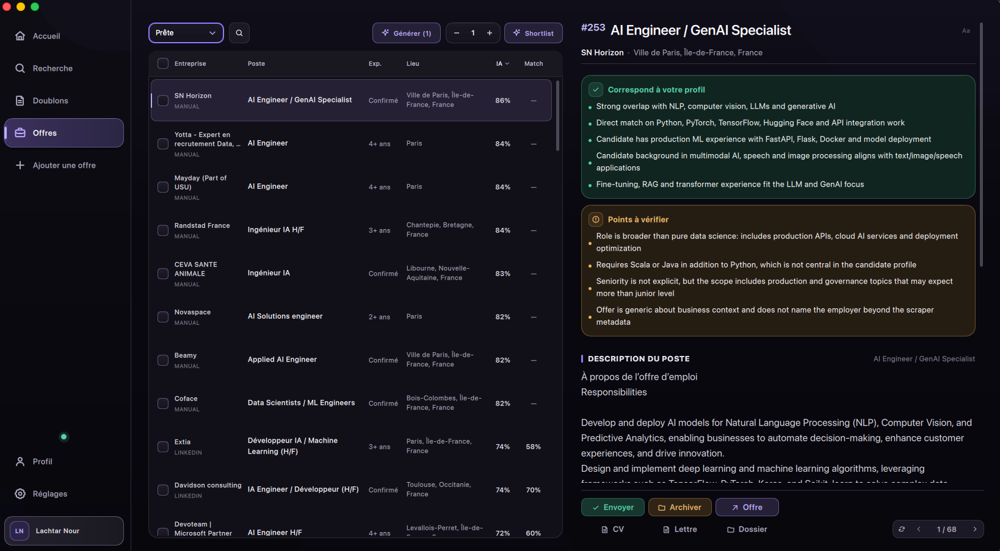
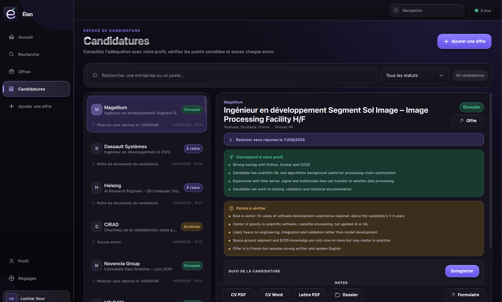

# Élan

<p align="center">
  <strong>Open-source macOS job-search assistant for a more focused job search.</strong><br>
  Find relevant opportunities, understand your fit, tailor your documents, and track every application from one native macOS app.
</p>

<p align="center">
  <a href="https://github.com/lachtarnour/smart-apply/stargazers"></a>
  <a href="https://github.com/lachtarnour/smart-apply/network/members"></a>
  <a href="https://github.com/lachtarnour/smart-apply/releases"></a>
  <br>
  
  
</p>

<p align="center">
  
</p>

<p align="center"><em>One place to see what needs attention next.</em></p>

<p align="center">
  <a href="#features">Features</a> ·
  <a href="#interface">Interface</a> ·
  <a href="#quick-start">Quick start</a> ·
  <a href="#adapt-élan-to-another-profile-or-project">Customize</a> ·
  <a href="#contributing">Contribute</a>
</p>

## Overview

Élan is an open-source macOS application that turns a scattered job search into a structured, review-first workflow:

```text
Discover → Filter → Rank → Review → Tailor documents → Track applications
```

It collects opportunities from several sources, removes duplicates, evaluates fit against a candidate profile, generates grounded application documents, and keeps the final decision with the candidate.

## Features

- **Multi-source search** — France Travail, Welcome to the Jungle, LinkedIn through Apify, and Google Jobs through SerpApi.
- **Local and bilingual filtering** — relevance, location, seniority, contract type, and language rules run locally before ranking.
- **Explainable matching** — alignment scores and review points help prioritize opportunities without making decisions for you.
- **Grounded documents** — tailored CVs and motivation letters are checked against the source profile before they are saved.
- **Application tracking** — statuses, follow-up dates, review points, documents, and next actions stay together.
- **Review-first email workflow** — Gmail integration prepares drafts for manual review; Élan never sends applications automatically.
- **Local-first storage** — profile data, SQLite database, cache, and generated documents remain on your Mac by default.

## Product boundaries

Élan helps you find, evaluate, prepare, and organize applications. It does not automatically apply to jobs, make hiring decisions, or send emails without your review. External providers are optional, and the published profile is a mock profile with placeholder data.

## Interface

The screenshots below show the current desktop interface, in the order a user typically moves through the product.

<p align="center">
  
</p>
<p align="center"><em>1. Search across several job sources with one set of criteria.</em></p>

<p align="center">
  
</p>
<p align="center"><em>2. Review ranked opportunities, scores, statuses, and fit explanations.</em></p>

<p align="center">
  
</p>
<p align="center"><em>3. Prepare, review, and follow up on each application.</em></p>

## Quick start

### Requirements

- macOS 13 or later
- Python 3.10 or later

### Install and run

```bash
git clone https://github.com/lachtarnour/smart-apply.git
cd smart-apply

cp .env.example .env
make install-desktop
make init-db
make run-desktop
```

To build the standalone macOS application:

```bash
make build-macos
open dist/Elan.app
```

For a first run without external credentials, use the mock providers in `.env`:

```dotenv
LLM_PROVIDER=mock
EMBEDDINGS_PROVIDER=mock
```

Add API credentials only for the sources and providers you want to use.

## Configuration

Copy `.env.example` to `.env`. The main settings are:

| Variable | Purpose | Required when… |
|---|---|---|
| `OPENAI_API_KEY` | Analysis, document adaptation, and embeddings | `LLM_PROVIDER` is not `mock` |
| `FRANCETRAVAIL_CLIENT_ID` / `FRANCETRAVAIL_CLIENT_SECRET` | France Travail API access | France Travail is enabled |
| `SERPAPI_API_KEY` | Google Jobs access | Google Jobs is enabled |
| `APIFY_TOKEN` | LinkedIn job collection through Apify | LinkedIn is enabled |
| `WTTJ_COOKIE` | Welcome to the Jungle access | WTTJ is enabled |
| `EMBEDDINGS_PROVIDER` | `openai`, `local`, or `mock` | optional |
| `PROFILE_DIR` | Location of the private candidate profile | optional |

By default, runtime data is stored under `~/Library/Application Support/Elan`. Keep personal information, API keys, and generated documents out of version control.

## Adapt Élan to another profile or project

Élan is designed to be adapted. The repository publishes a safe example profile, while the deterministic matching rules are tuned for the original use case. When adapting the project to another candidate, country, role family, or hiring policy, update both the profile data and the static filters.

### 1. Replace the profile data

[`smartapply/profile/mock_profile/`](smartapply/profile/mock_profile/) is the published reference profile. It documents the expected JSON structure and contains no private candidate data.

Create a private working profile from it:

```bash
mkdir -p smartapply/profile/data
cp smartapply/profile/mock_profile/*.json smartapply/profile/data/
```

Edit the files in `smartapply/profile/data/`:

| File | Content |
|---|---|
| `identity.json` | Name, contact details, title, location, and summary |
| `preferences.json` | Target roles, accepted contracts, remote policies, languages, domains, and deal-breakers |
| `skills.json` | Skills, matching keywords, evidence, and allowed claims |
| `experiences.json` | Work history and verifiable achievements |
| `projects.json`, `education.json`, `languages.json`, `certificates.json` | Optional supporting information |
| `style_guide.json`, `template_style.json` | Writing and document presentation preferences |

Set `PROFILE_DIR` in `.env` when the private profile lives outside `smartapply/profile/data/`. Do not commit real personal information; `mock_profile` is the publishable template.

### 2. Update the hard-coded static filters

The profile controls the main user preferences, but several deterministic vocabularies and safety gates are hard-coded for predictable filtering. Review these files when the default behavior does not match your domain:

| File | What to change |
|---|---|
| [`smartapply/filtering/rules.py`](smartapply/filtering/rules.py) | Positive and negative title keywords, hard rejects, seniority gates, description penalties, blocked contracts, and score thresholds |
| [`smartapply/pipeline/ingest/role_families.py`](smartapply/pipeline/ingest/role_families.py) | Search role families and bilingual aliases used to expand search queries |
| [`smartapply/filtering/relevance.py`](smartapply/filtering/relevance.py) | Bilingual role concepts, title patterns, technical concepts, and off-target role patterns |
| [`smartapply/filtering/role_signals.py`](smartapply/filtering/role_signals.py) | Domain, analytics, engineering, and off-target signal vocabularies |
| [`smartapply/filtering/contract_signals.py`](smartapply/filtering/contract_signals.py) | Contract markers and contextual exceptions |
| [`smartapply/filtering/seniority.py`](smartapply/filtering/seniority.py) | Seniority and people-management patterns |
| [`smartapply/filtering/location_signals.py`](smartapply/filtering/location_signals.py) | Location markers and foreign-location detection patterns |

Recommended order:

1. Update `preferences.json` first.
2. Adjust `rules.py` and `role_families.py` for the new target.
3. Update the deeper signal files only when you need domain-specific vocabulary or different safety gates.
4. Run the test suite after every filter change.

```bash
make test-fast
```

## Architecture

```text
Job sources
    ↓
Normalization and deduplication
    ↓
Bilingual local filtering
    ↓
Semantic ranking
    ↓
Structured analysis
    ↓
CV and motivation-letter generation
    ↓
Deterministic validation
    ↓
Application tracking in SQLite
```

```text
smartapply/
├── scrapers/       Source connectors
├── filtering/      Local rules and bilingual signals
├── ranking/        Embeddings and scoring
├── llm/            Prompts and structured outputs
├── cv/             Adaptation, validation, and rendering
├── pipeline/       Workflow orchestration
├── database/       Local SQLite persistence
└── desktop/        Qt Quick macOS application
```

## Development

```bash
make lint
make test-fast
make build-macos
```

The maintenance CLI is available for diagnostics:

```bash
elan --help
elan init-db
elan stats
```

## Roadmap

- [x] Multi-source search and manual offer entry
- [x] Filtering, deduplication, and semantic ranking
- [x] CV and motivation-letter generation with validation
- [x] Application tracking workspace
- [ ] Guided import of an existing CV
- [ ] Additional connectors and optional synchronization
- [ ] Simpler packaging and distribution

## Contributing

Bug reports, ideas, and pull requests are welcome. Please include context, reproduction steps, and an anonymized screenshot when relevant. Before opening a pull request, run:

```bash
make lint
make test-fast
```

If Élan helps your job search, consider giving the project a ⭐ on GitHub. It helps other people discover it.

## License

MIT — see [LICENSE](LICENSE).
